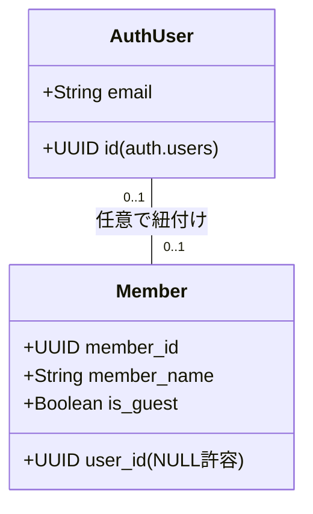
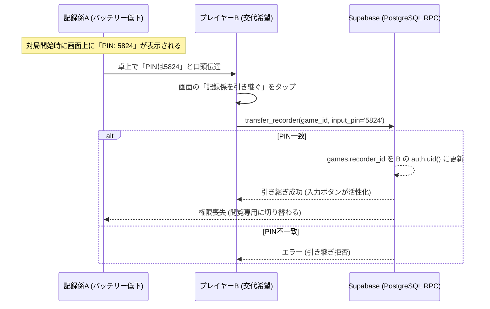

# 麻雀スコア管理システム 詳細設計書（Web・ローカルハイブリッド構成）

## 1. システム概要とハイブリッド全体像

本システムは、四麻の対局進行、リアルタイムスコア共有、および詳細な個人・グループ成績集計・分析を行うシステムである。
既存の**「PCによる完全オフライン入力・高速集計環境（Streamlit + SQLite）」**を100%維持したまま、新たに**「複数端末から同時利用可能なリアルタイムWebアプリ（Next.js + Supabase on Cloudflare Pages）」**を追加・統合する**ハイブリッド構成**を採用する。

### 1.1 ハイブリッド運用モデル

```
┌─────────────────────────────────────────────────────────┐
│ 【PC環境】完全オフライン専用                             │
│  Streamlit + SQLite (local_mahjong_v2_new.db)           │
│  - ネット接続不要、完全ローカルで安全・高速動作         │
│  - 既存の全資産（UI、集計、テスト全38件）を完全維持     │
└────────────┬───────────────────────────────▲────────────┘
             │ ネット接続時                  │ ネット接続時
             │ 【Push同期】                  │ 【Pull同期】
             │ (選択的アップロード)          │ (全件ダウンロード)
             ▼                               │
┌────────────────────────────────────────────┴────────────┐
│ 【クラウド正本基盤】完全無料枠 ($0)                     │
│  Supabase (PostgreSQL / Auth / Realtime)                │
│  - 第3正規形・UUID v7スキーマ                           │
│  - Row Level Security (RLS) による権限・排他制御        │
│  - GitHub Actions による7日間スリープ防止cron           │
└────────────────────────────▲────────────────────────────┘
                             │
                             │ HTTPS / WebSocket (リアルタイム通信)
                             ▼
┌─────────────────────────────────────────────────────────┐
│ 【スマートフォン・外部端末環境】リアルタイムWebアプリ   │
│  Next.js (TypeScript) on Cloudflare Pages (静的SPA)     │
│  - 卓上の1台（記録係）が入力、他3人は手元で即座に自動同期│
│  - 4桁PINによる記録係交代（フェイルオーバー）           │
│  - LocalStorage下書きによる通信断・誤操作からの復元     │
│  - 複数卓（2卓以上）の完全独立同時並行進行              │
└─────────────────────────────────────────────────────────┘
```

---

## 2. 技術スタックとインフラ構成

### 2.1 採用技術一覧

| レイヤー | 技術 | 稼働環境 | 選定理由・運用コスト |
| :--- | :--- | :--- | :--- |
| **PC（ローカル）** | Python / Streamlit / SQLite | PCローカル（Windows） | 完全オフライン動作、既存資産の継続利用（$0） |
| **Webフロントエンド** | Next.js (TypeScript / Tailwind CSS) | Cloudflare Pages（静的SPA） | `output: 'export'` による完全静的配信。エッジ互換性問題ゼロ、無制限帯域（$0） |
| **BaaS / データベース** | Supabase (PostgreSQL) | クラウド (AWS東京リージョン) | 第3正規形、RLS、Realtime、Auth統合（500MBまで無料：$0） |
| **認証** | Supabase Auth | クラウド | セッション暗号化永続化（50,000 MAUまで無料：$0） |
| **リアルタイム通信** | Supabase Realtime | クラウド | 局確定時のWebSocketプッシュ配信（同時200接続まで無料：$0） |
| **CI / スリープ防止** | GitHub Actions | クラウド | 毎朝0時の自動ヘルスチェックcron（無料枠内：$0） |

### 2.2 アーキテクチャの厳格な制約
- **FastAPI / Pythonバックエンドの排除:**
  Web側ではPythonサーバーを置かない。点数計算・ウマオカ計算・連荘判定・飛び判定はすべてTypeScriptの純粋関数ライブラリとしてフロントエンド内に完全移植する。
- **Supabase Storageの排除:**
  画像等のバイナリ保存要件が存在しないため、ストレージ機能は一切使用しない。

---

## 3. ユーザー認証とメンバー管理仕様（論点1：案A）

### 3.1 認証とメンバーの分離モデル
「アカウント」と「対局メンバー」を分離することで、**スマホを持たない高齢者やアカウントを持たないゲストが混ざっても対局が一切ストップしない運用**を実現する。



1. **ログインアカウント（`auth.users`）：**
   - 記録係（または管理者）のみがログイン必須。
   - 初回ログイン時に端末のブラウザ（LocalStorage/Cookie）に暗号化トークンが永続保存され、**2回目以降は毎回ログイン不要**（URLを開くだけで即利用可能）。
2. **メンバーマスタ（`members`）：**
   - 対局を行うプレイヤー（親族、麻雀部員、ゲスト等）は、アカウントの有無に関わらず `members` テーブルに登録される。
   - 記録係は、対局作成時にドロップダウンから登録済みメンバー4名を自由に選択して対局を開始できる。
   - 自分のアカウントを持つメンバーは、ログインすることで「自分の個人成績」を即座に絞り込み閲覧できる。

---

## 4. 対局進行・排他制御・フェイルオーバー設計（論点2：4桁PIN交代制）

### 4.1 単一入力・複数閲覧モデル
同時入力によるデータ競合や局順序の破綻を防止するため、対局の操作権限は常に1台に限定する。

* **記録係端末（1台）：** 和了・流局・リーチ・チョンボ・Undo・対局終了の入力ボタンが活性化。
* **閲覧端末（他3人・観戦者）：** 入力ボタンを完全非活性（`disabled` または非表示）とし、スコアボード・点差・順位のみをリアルタイム表示。

### 4.2 4桁PINコードによるフェイルオーバー（記録係の交代）
記録係のスマートフォンがバッテリー切れ、端末故障、離席等で使えなくなった場合、その場で別の端末へ入力権限を移譲できる。



#### PostgreSQL RPC関数（ストアドプロシージャ）定義
```sql
CREATE OR REPLACE FUNCTION transfer_recorder(p_game_id UUID, p_pin TEXT)
RETURNS BOOLEAN
LANGUAGE plpgsql
SECURITY DEFINER
AS $$
DECLARE
    v_correct_pin TEXT;
BEGIN
    SELECT passcode INTO v_correct_pin FROM games WHERE game_id = p_game_id;
    IF v_correct_pin IS NULL OR v_correct_pin != p_pin THEN
        RAISE EXCEPTION '無効な対局PINコードです';
    END IF;
    
    UPDATE games 
    SET recorder_id = auth.uid() 
    WHERE game_id = p_game_id;
    
    RETURN TRUE;
END;
$$;
```

---

## 5. 2段階データ整合性・中断復元設計（論点3）

### 5.1 LocalStorage下書き ＋ クラウド確定の分離
通信断や入力中の画面離脱によるデータ喪失を防ぎつつ、他端末へのチラつき事故を防止する。

| レイヤー | 保存場所 | 保存タイミング | 保存内容 | 公開範囲 |
| :--- | :--- | :--- | :--- | :--- |
| **第1段階（下書き）** | 端末の `LocalStorage` | 入力モーダルで翻・符・和了者・放銃者を選択する**1タップごと** | 未確定の入力フォーム状態 | 本人端末のみ（非公開） |
| **第2段階（確定保存）** | Supabase (PostgreSQL) | 記録係が「局結果を確定」ボタンを押した**瞬間のみ** | 計算済みスコア、局詳細、対局ヘッダ | 全端末へRealtime通知 |

### 5.2 障害・中断からの復元フロー
- **ブラウザ誤閉じ・電話着信・クラッシュ時:**
  再アクセス時、対局画面初期化処理が `LocalStorage` を走査。未確定の入力状態が存在すれば「入力中の局データがあります。復元しますか？」とダイアログを表示し、1タップで選択状態を100%復元。
- **通信切断時（電波圏外・雀荘地下）:**
  「確定」送信がネットワークエラーで失敗した場合、局データをローカルの「未送信キュー」に退避し、画面は正常に次局へ進める。電波回復を検知次第、バックグラウンドで自動再送する。

---

## 6. リアルタイム通信仕様とマルチ卓設計

### 6.1 Supabase Realtimeチャンネル設計
対局ごとに独立したチャンネルを購読（Subscribe）することで、**同時に2卓以上（卓A、卓B）が進行してもデータが混ざらない**完全分離を実現する。

```typescript
// Next.jsクライアント側でのチャンネル購読設計
const channelName = `game:${currentGameId}`;
const channel = supabase
  .channel(channelName)
  .on(
    'postgres_changes',
    {
      event: 'UPDATE',
      schema: 'public',
      table: 'games',
      filter: `game_id=eq.${currentGameId}`
    },
    (payload) => {
      // 記録係が確定した最新スコア・局・本場を画面へ即時反映
      updateLocalScoreboard(payload.new);
    }
  )
  .subscribe();
```

---

## 7. データベース物理設計（Supabase PostgreSQL / V2スキーマ完全準拠）

`migrations/supabase_migration_v2.sql` および `local_mahjong_v2_new.db` で確定した全8テーブルのDDL仕様。

### 7.1 DDL（テーブル定義）

```sql
-- 1. members
CREATE TABLE public.members (
    member_id UUID PRIMARY KEY,
    user_id UUID REFERENCES auth.users(id) ON DELETE SET NULL,
    member_name TEXT NOT NULL,
    is_guest INTEGER NOT NULL DEFAULT 0,
    is_archived INTEGER NOT NULL DEFAULT 0,
    created_at TIMESTAMPTZ NOT NULL DEFAULT now()
);

-- 2. groups
CREATE TABLE public.groups (
    group_id UUID PRIMARY KEY,
    display_id TEXT UNIQUE NOT NULL,
    group_name TEXT NOT NULL,
    default_rule_id TEXT NOT NULL,
    is_archived INTEGER NOT NULL DEFAULT 0,
    created_at TIMESTAMPTZ NOT NULL DEFAULT now()
);

-- 3. group_memberships
CREATE TABLE public.group_memberships (
    group_id UUID NOT NULL REFERENCES public.groups(group_id) ON DELETE CASCADE,
    member_id UUID NOT NULL REFERENCES public.members(member_id) ON DELETE CASCADE,
    PRIMARY KEY (group_id, member_id)
);

-- 4. rule_templates
CREATE TABLE public.rule_templates (
    rule_id TEXT PRIMARY KEY,
    name TEXT NOT NULL,
    kind TEXT NOT NULL, -- 'official' | 'custom'
    version INTEGER NOT NULL DEFAULT 1,
    config_json JSONB NOT NULL,
    is_archived INTEGER NOT NULL DEFAULT 0,
    created_at TIMESTAMPTZ NOT NULL DEFAULT now()
);

-- 5. games
CREATE TABLE public.games (
    game_id UUID PRIMARY KEY,
    played_at TIMESTAMPTZ NOT NULL DEFAULT now(),
    group_id UUID NOT NULL REFERENCES public.groups(group_id),
    recorder_id UUID REFERENCES auth.users(id),
    passcode TEXT NOT NULL, -- 4桁PIN（引き継ぎ用）
    status TEXT NOT NULL DEFAULT 'in_progress', -- 'in_progress' | 'finished'
    rule_name_snapshot TEXT NOT NULL,
    rule_config_snapshot JSONB NOT NULL,
    game_mode TEXT NOT NULL DEFAULT 'detail',
    sync_target INTEGER NOT NULL DEFAULT 1,
    is_synced INTEGER NOT NULL DEFAULT 1,
    created_at TIMESTAMPTZ NOT NULL DEFAULT now()
);

-- 6. game_participants
CREATE TABLE public.game_participants (
    game_id UUID NOT NULL REFERENCES public.games(game_id) ON DELETE CASCADE,
    seat INTEGER NOT NULL CHECK (seat BETWEEN 1 AND 4),
    member_id UUID NOT NULL REFERENCES public.members(member_id),
    player_name_snapshot TEXT NOT NULL,
    final_score INTEGER NOT NULL,
    rank INTEGER NOT NULL CHECK (rank BETWEEN 1 AND 4),
    point NUMERIC(6,1) NOT NULL,
    was_group_member INTEGER NOT NULL DEFAULT 1,
    PRIMARY KEY (game_id, seat)
);

-- 7. rounds
CREATE TABLE public.rounds (
    round_id UUID PRIMARY KEY,
    game_id UUID NOT NULL REFERENCES public.games(game_id) ON DELETE CASCADE,
    round_index INTEGER NOT NULL,
    kyoku_name TEXT NOT NULL,
    honba INTEGER NOT NULL DEFAULT 0,
    riichi_sticks INTEGER NOT NULL DEFAULT 0,
    result_type TEXT NOT NULL, -- 'ron' | 'tsumo' | 'ryukyoku' | 'chombo'
    created_at TIMESTAMPTZ NOT NULL DEFAULT now()
);

-- 8. round_seats
CREATE TABLE public.round_seats (
    round_id UUID NOT NULL REFERENCES public.rounds(round_id) ON DELETE CASCADE,
    seat INTEGER NOT NULL CHECK (seat BETWEEN 1 AND 4),
    member_id UUID NOT NULL REFERENCES public.members(member_id),
    base_point INTEGER NOT NULL DEFAULT 0,
    honba_point INTEGER NOT NULL DEFAULT 0,
    kyotaku_point INTEGER NOT NULL DEFAULT 0,
    penalty_point INTEGER NOT NULL DEFAULT 0,
    score_delta INTEGER NOT NULL DEFAULT 0,
    chip_delta INTEGER NOT NULL DEFAULT 0,
    han INTEGER,
    fu INTEGER,
    is_winner INTEGER NOT NULL DEFAULT 0,
    is_loser INTEGER NOT NULL DEFAULT 0,
    is_riichi INTEGER NOT NULL DEFAULT 0,
    is_furo INTEGER NOT NULL DEFAULT 0,
    is_tenpai INTEGER NOT NULL DEFAULT 0,
    PRIMARY KEY (round_id, seat)
);
```

### 7.2 Row Level Security (RLS) ポリシー

```sql
-- RLS有効化
ALTER TABLE games ENABLE ROW LEVEL SECURITY;
ALTER TABLE game_participants ENABLE ROW LEVEL SECURITY;
ALTER TABLE rounds ENABLE ROW LEVEL SECURITY;
ALTER TABLE round_seats ENABLE ROW LEVEL SECURITY;

-- 閲覧: 認証済みユーザーは全データ閲覧可能
CREATE POLICY "全認証ユーザーが対局閲覧可能" ON games FOR SELECT TO authenticated USING (true);
CREATE POLICY "全認証ユーザーが参加者閲覧可能" ON game_participants FOR SELECT TO authenticated USING (true);
CREATE POLICY "全認証ユーザーが局データ閲覧可能" ON rounds FOR SELECT TO authenticated USING (true);
CREATE POLICY "全認証ユーザーが局座席閲覧可能" ON round_seats FOR SELECT TO authenticated USING (true);

-- 作成: 記録係本人のみ新規対局INSERT可能
CREATE POLICY "記録係の対局作成許可" ON games FOR INSERT TO authenticated WITH CHECK (auth.uid() = recorder_id);

-- 更新: 記録係本人のみ対局UPDATE可能（排他制御）
CREATE POLICY "記録係のみ対局更新許可" ON games FOR UPDATE TO authenticated USING (auth.uid() = recorder_id);
CREATE POLICY "記録係のみ参加者更新許可" ON game_participants FOR ALL TO authenticated 
    USING (EXISTS (SELECT 1 FROM games g WHERE g.game_id = game_participants.game_id AND g.recorder_id = auth.uid()));
CREATE POLICY "記録係のみ局データ操作許可" ON rounds FOR ALL TO authenticated 
    USING (EXISTS (SELECT 1 FROM games g WHERE g.game_id = rounds.game_id AND g.recorder_id = auth.uid()));
CREATE POLICY "記録係のみ局座席操作許可" ON round_seats FOR ALL TO authenticated 
    USING (EXISTS (SELECT 1 FROM rounds r JOIN games g ON r.game_id = g.game_id WHERE r.round_id = round_seats.round_id AND g.recorder_id = auth.uid()));
```

---

## 8. PC / クラウド間データ同期プロトコル

現行の分散ハイブリッド同期エンジン（`src/database2.py` / `scripts/sync_from_remote.py`）仕様に完全準拠する。

1. **PCからクラウドへのPush同期（選択的同期）：**
   - PCで記録した対局のうち、`sync_target = 1` かつ `is_synced = 0` のレコードのみをSupabaseへアップロード。
   - アップロード完了後、PC側の `is_synced` を `1` に更新。
2. **クラウドからPCへのPull同期（全件同期）：**
   - スマホ（Webアプリ）で記録された対局（PC側に存在しない `game_id`）をSupabaseから差分取得し、PCの `local_mahjong_v2_new.db` に不可分トランザクションで挿入。
   - PC単独での完全オフライン集計・分析画面に即座に反映される。

---

## 9. スリープ防止・監視運用設計

* **制約：** Supabase無料枠は7日間アクセスがないとDBが自動停止（Pause）する。
* **対策：** GitHub Actions ワークフロー（`.github/workflows/supabase_keepalive.yml`）を配置。
  ```yaml
  name: Supabase Keepalive
  on:
    schedule:
      - cron: '0 15 * * *' # 毎日JST午前0時に実行
    workflow_dispatch:
  jobs:
    ping:
      runs-on: ubuntu-latest
      steps:
        - name: Ping Supabase REST API
          run: |
            curl -f -s -H "apikey: ${{ secrets.SUPABASE_ANON_KEY }}" "${{ secrets.SUPABASE_URL }}/rest/v1/rule_templates?select=rule_id&limit=1" > /dev/null
  ```

---

## 10. 開発ロードマップと突合テストプロトコル

### 10.1 開発フェーズ

| フェーズ | 作業内容 | 検証完了基準 |
| :--- | :--- | :--- |
| **Phase 1: DB & ロジック基盤** | 1. Supabaseへスキーマ・RLS・RPC適用<br>2. `src/calc.py` と `src/game_logic.py` をTypeScriptへ移植<br>3. TypeScript単体テスト（Vitest） | 点数計算・ウマオカ・連荘判定の全テストケースがTypeScriptで100%パス |
| **Phase 2: 突合テスト（最重要）** | `local_mahjong_v2_new.db` の全データをSupabaseへ移行し、**Streamlit集計値とSupabase集計値を全対局突合** | 全対局の総合得点・個人スタッツ・順位率が1pt・0.1%の狂いもなく完全一致 |
| **Phase 3: Web対局コア画面** | 1. Next.js SPA構築（Tailwind CSS）<br>2. 記録係モード（入力活性）と閲覧モード（非活性）<br>3. 4桁PIN引き継ぎ機能<br>4. Supabase Realtime自動更新 | スマホ2台で片方が確定したスコアが、もう片方にリロード不要で即座に反映されること |
| **Phase 4: 成績集計UI & デプロイ** | 1. 個人・グループ・ルール別集計画面<br>2. Cloudflare Pagesへの静的SPA自動デプロイ<br>3. GitHub Actions スリープ防止cron稼働 | 実機スマートフォン（iOS / Android）での実戦対局テスト完了 |

---

### 10.2 突合検証スクリプト仕様（Phase 2）
移行時に実行する自動突合スクリプト（`scripts/verify_web_migration.py`）により以下を自動検証する：
1. **総対局数・局数の一致:** SQLiteとSupabaseの `COUNT(games)`, `COUNT(rounds)` の完全一致。
2. **確定ポイントの一致:** 全プレイヤーの `SUM(point)` および各試合の `final_score` の100%完全一致。
3. **スタッツ値の一致:** 和了率、放銃率、立直率、平均順位が小数点第1位まで完全一致。

---

## 11. フロントエンド品質・非機能設計（ラグ・CSS・保守性）

### 11.1 体感レイテンシゼロ設計（楽観的UI更新と二重押し防止）
Streamlit特有の「ボタン操作後の再描画ラグ」を完全に排除する。

1. **楽観的UI更新（Optimistic Update）：**
   - リーチ宣言や点数確定ボタンを押した瞬間、Supabaseとの通信（100〜300ms）を待たずに、**手元画面の持ち点・局表示を0ミリ秒で即時先行更新**する。
   - 裏側で非同期にSupabaseへデータ送信を行い、万が一通信が失敗した場合のみロールバックして警告を表示する。
2. **二重送信・連打の物理的遮断（Debounce & Disabled）：**
   - 「確定」ボタンを押した瞬間に、ボタンを `disabled` 状態へ移行させ、スピナーを表示する。
   - 確定処理が完了するまでの間、連続タップや二重送信による局重複登録を物理的に防止する。

### 11.2 スマートフォンUI・CSS設計（誤タップ・レイアウト崩れの防止）
卓上で片手で素早く正確に入力できるモバイル特化UIを実現する。

1. **ダブルタップズームの完全禁止：**
   - スマホでボタンを連打した際に画面が拡大されてレイアウトがガタつく現象を防ぐため、全操作要素に `touch-action: manipulation` を強制適用し、ビューポートメタタグで拡大を無効化する。
2. **最小タッチターゲット（48px基準）：**
   - 和了、放銃、リーチ、点数選択などの主要ボタンは**高さ48px以上、マージン8px以上**を確保し、押し間違えを防止する。
3. **1画面スクロールレス（固定画面レイアウト）：**
   - 対局入力画面は縦スクロールを完全に排除。Flexbox / Grid により、スマートフォンの1画面内に「4人のスコアボード」「リーチボタン」「局結果確定ボタン」がぴったり収まるレイアウトを強制する。
4. **CSSスパゲッティ化の防止（Tailwind CSSの徹底）：**
   - グローバルCSSの手書きによる肥大化・崩壊を防ぐため、スタイリングはすべて **Tailwind CSS** のユーティリティクラスのみで完結させる。

### 11.3 3層クリーンアーキテクチャ（コード肥大化・保守性破綻の防止）
React/Next.jsで画面コードの中に計算や通信が混入してスパゲッティ化するのを防ぐため、厳格な3層分離を適用する。

```
┌─────────────────────────────────────────────────────────┐
│ ① UIプレゼンテーション層 (components/ScoreBoard.tsx 等) │
│   - 見た目の描画とタップイベント検知のみ。               │
│   - 麻雀のルール計算やAPI通信コードは1行も含めない。     │
└────────────────────────────▲────────────────────────────┘
                             │ イベント通知 / 表示データ受取
┌────────────────────────────┴────────────────────────────┐
│ ② 状態管理・通信フック層 (hooks/useGame.ts)             │
│   - Supabase通信、LocalStorage下書き、Realtime購読を集約。│
│   - UI層と純粋ドメイン層を接続する接着剤。               │
└────────────────────────────▲────────────────────────────┘
                             │ 純粋な関数呼び出し
┌────────────────────────────┴────────────────────────────┐
│ ③ 麻雀計算・純粋ドメイン層 (lib/mahjong/calc.ts 等)     │
│   - ReactやSupabaseに一切依存しないPure TypeScript。     │
│   - 引数を渡すと点数や次局が返る副作用ゼロの関数群。     │
│   - Vitest による単体テストを100%網羅。                  │
└─────────────────────────────────────────────────────────┘
```

### 11.4 誤入力時の「1局巻き戻し（Undo）」の安全設計
局結果を間違えて確定してしまった場合の復元仕様。

1. 記録係画面に「1局戻す（Undo）」ボタンを常設。
2. 押下時、直前の局データ（`rounds`, `round_seats`）を削除し、対局ヘッダ（`games`）の点数・局・本場・供託を1局前の状態に復元。
3. この巻き戻し結果もSupabase Realtimeを通じて他端末へ即時プッシュされ、全員の画面が1局前に整合性を保って巻き戻る。

### 11.5 PWA（Progressive Web App）対応
- `manifest.json` および専用アイコンを配備。
- スマートフォンの「ホーム画面に追加」を行うことで、ブラウザのアドレスバーや下部ナビゲーションを完全に消去。
- ネイティブアプリと同等の全画面表示で、誤タップを防ぎつつ最大限の入力領域を確保する。

---

## 12. 高信頼・拡張性（シンプル＆ロバスト）設計規約

### 12.1 壊れにくさの担保（既存安全資産の活用と不可逆事故の防止）
余計な機能や複雑な同期機構を無駄に追加せず、既存の安全資産と確実な防壁を活用する。

1. **既存安全フック・スクリプトの継続利用:**
   - 危険なGit操作やDB直接破壊を監視する [`scripts/safety_hook.py`](file:///c:/Users/segu1/MyFiles/開発/repos/mahjong_personal/scripts/safety_hook.py) をそのまま継続。
   - クラウドデータ退避用の [`scripts/backup_supabase.py`](file:///c:/Users/segu1/MyFiles/開発/repos/mahjong_personal/scripts/backup_supabase.py) を移行前後のバックアップに活用。
   - PCローカルDB（`local_mahjong_v2_new.db`）の OneDrive 定期退避運用を維持。
2. **過去DBの不可侵（Read-Only）移行プロトコル:**
   - SQLiteからSupabaseへのデータ移行スクリプトは、接続時に `mode=ro`（URI読込専用モード）を強制し、過去DBへの物理的な書き込み・変更事故を完全に遮断。
3. **入力データの確実な保護（LocalStorage下書き ＋ 不可分RPC）：**
   - 入力中の操作はブラウザ内 `LocalStorage` に即時保存。電話着信・ブラウザ誤閉じ時も手元のデータは100%復元可能。
   - クラウドへの確定送信時は1回のPostgreSQL不可分RPCでコミットし、通信断による不整合を防止。

### 12.2 拡張のしやすさの担保（後から機能追加しても壊れない構造）
将来の仕様追加時に既存データを壊さない柔軟な構造を維持する。

1. **スキーマ不変の原則（JSONB設定の活用）：**
   - ルール設定（`rule_templates.config_json`）および対局スナップショット（`games.rule_config_snapshot`）はJSONBで管理。
   - 将来「三麻対応」「特殊チップ」「新規ローカル役」などの新ルールや計算条件が増えた場合でも、**テーブル定義（DDL）を変更することなく、JSON内のキー追加のみで安全に拡張可能**。過去対局の集計を一切破壊しない。
2. **3層分離による影響範囲の極小化：**
   - 「計算ロジック（`lib/mahjong/`）」と「画面（`components/`）」を完全に切り離しているため、新しい成績グラフや集計画面を追加しても、対局入力や点数計算コードにバグが波及しない。

### 12.3 初期リリースの最小構成（Minimal Core）
開発原則「できるだけシンプルに、余計な機能や判定を無駄に追加しない」に基づき、初期リリースは以下の3機能に絞り込んで開発・検証する。

1. 記録係による確実な対局入力（リーチ、ロン、ツモ、流局、Undo）
2. 他端末へのリアルタイムスコア自動反映（Supabase Realtime）
3. 過去成績・個人成績の正確な一覧表示


