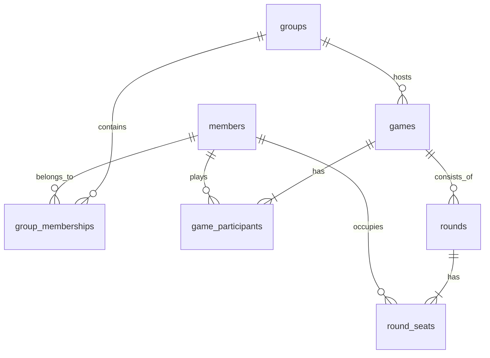

# 麻雀スコア管理Webアプリ システム仕様書

## 1. システム概要と目的

### 1.1 概要
本仕様書は、現在Streamlit（`app.py`、`local_mahjong_v2_new.db`）で稼働している麻雀スコア管理・分析システムを、複数端末（PC・スマートフォン）から安全かつリアルタイムに利用可能なWebアプリケーションへ移行するための設計仕様を定義する。

### 1.2 目的
1. **複数端末での同時利用:** 卓上の1台（記録係のスマートフォン等）で点数を入力し、同卓者や閲覧者の端末へリアルタイムにスコアを自動反映する。
2. **クラウド一元管理:** クラウド上のPostgreSQL（Supabase）を正本（Single Source of Truth）とし、端末を問わず同一データを閲覧・管理する。
3. **完全無料での永続運用:** バックエンド常駐サーバーを排除し、クラウドの無料枠（Free Tier）の範囲内（$0）で永続稼働させる。

---

## 2. システム構成と技術スタック

### 2.1 採用技術

| レイヤー | 採用技術 | 役割 | 費用 |
| :--- | :--- | :--- | :--- |
| **フロントエンド** | Next.js (App Router) / TypeScript / Tailwind CSS | 画面描画、入力フォーム、点数計算・局進行ロジック、状態管理 | 無料 |
| **ホスティング** | Cloudflare Pages | Webアプリの配信、HTTPS、エッジルーティング、DDoS保護 | 無料 |
| **BaaS / データベース** | Supabase (PostgreSQL) | データ一元管理、Row Level Security (RLS) による権限制御 | 無料 (500MBまで) |
| **ユーザー認証** | Supabase Auth | 端末ごとのユーザー認証、暗号化セッション維持、UUID発行 | 無料 (50,000 MAUまで) |
| **リアルタイム通信** | Supabase Realtime | 局確定時のWebSocketプッシュ通知による他端末自動更新 | 無料 (同時200接続まで) |
| **スリープ防止 / CI** | GitHub Actions | 定期実行（cron）によるSupabaseヘルスチェック、自動デプロイ | 無料 |

### 2.2 アーキテクチャ選定における技術的根拠
- **FastAPI / Pythonの不採用理由:**
  麻雀の点数計算、ウマオカ計算、連荘・飛び判定はすべて四則演算とテーブル参照（数十〜数百行）で完結する。NumPyやSciPyなどの高度な科学計算ライブラリは不要であり、すべてTypeScriptの純粋関数として実装可能である。FastAPIサーバーを挟むと二重のサーバー保守・デプロイ費用・CORS・認証トークン検証のオーバーヘッドが発生するため、構成から完全排除する。
- **Supabase Storageの不採用理由:**
  対局、メンバー、成績データはすべてリレーショナルデータであり、画像やバイナリファイルのアップロード要件が存在しないため、不要なストレージ機能は利用しない。

---

## 3. 主要機能・動作仕様

### 3.1 認証・セッション維持（毎回ログイン不要）
- **初回ログイン:** ユーザーは初回のみメール/パスワードまたは簡易暗証コード（PIN）でログインする。
- **セッション維持:** Supabase Authにより、ブラウザ（Cookie/LocalStorage）にセッション情報が安全に永続化される。ブラウザを閉じたり端末を再起動してもログイン状態は維持され、次回以降はURLを開くだけで即座にアプリを利用できる。
- **ユーザー識別:** 各端末にはログインしたユーザー固有のUUID（`auth.uid()`）が割り当てられ、メンバーマスタ（`members.user_id`）と紐付けられる。

### 3.2 対局進行と排他制御（単一入力・複数閲覧モデル）
複数端末が同時に同じ対局を開いた際、データの競合や上書き事故を防ぐため、**「入力権限は1人（記録係）のみ、他は閲覧専用」**に固定する。

1. **対局開始と記録係の確定:**
   - 対局を開始したユーザーのUUIDを `games.recorder_id` に保存する。
2. **画面側のUI制御（Next.js）:**
   - `currentUser.id === game.recorder_id` の場合：和了・流局・リーチ・チョンボ・Undo等の入力ボタンを活性表示。
   - それ以外の端末の場合：入力ボタンを非表示または非活性（`disabled`）とし、点数表・点差表示・進行状況のみを表示する。
3. **データベース層での防壁（PostgreSQL RLS）:**
   - 画面を不正に改ざんしてAPIリクエストを送信した場合でも、DB側のRLSポリシーにより `auth.uid() = recorder_id` でないUPDATE処理は即座に拒否される。

### 3.3 リアルタイムスコア自動同期（Supabase Realtime）
- 記録係が局結果を確定（DBへ保存）した瞬間、Supabase Realtime（Postgres Changes）経由で購読中の全端末へ通知が届く。
- 閲覧側の端末は画面のリロードを行わずに、手元の持ち点、順位、点差グラフ、局数がミリ秒単位で自動的に再描画される。
- 通信切断時やバックグラウンド復帰時は、自動的に最新の対局状態を再取得（Re-fetch）して整合性を回復する。

### 3.4 対局中断・セッション喪失対策（ドラフト保存の継承）
V2で確立された安全プロトコル（全アクション即時保存）をWeb版でも踏襲する。

- **自動ドラフト保存:** リーチ宣言、副露、和了入力、流局、Undoなど、対局中のあらゆる状態変更は直ちにローカル状態およびDBの中間状態（ドラフト）へ保存する。
- **復旧フロー:** スマホのバッテリー切れ、誤ってブラウザを閉じる、通信切断等が発生しても、再度アプリを開いた際に自動的に直前の局・本場・点数状態で対局を再開できる。

### 3.5 成績集計・分析機能
- **全体成績・グループ別成績:**
  - 親族麻雀、麻雀部など、選択されたグループごとの成績フィルタリング。
  - 「外部参加者を含む」トグル切り替え（同卓したゲストを含む集計と、純粋な所属メンバーのみの集計を分離）。
- **個人成績・詳細スタッツ:**
  - 平均順位、トップ率、連対率、飛び率、通算ポイント。
  - 局詳細データに基づく高度な分析（和了率、放銃率、リーチ率、副露率、ダマ和了率、平均打点、打点効率など）。
- **過去対局詳細の閲覧:**
  - 対局開始時点のルールスナップショットに基づき、過去の全対局・全局の推移を不変の状態で表示。

### 3.6 ルールテンプレート・グループ管理
- **公式テンプレート:** Mリーグルール等の標準ルール（編集不可）。
- **カスタムテンプレート:** 公式を複製して編集・作成。削除は行わずアーカイブ（`is_archived = 1`）管理。
- **ルール不変性の保証:** 対局開始時点のルール完全JSONを `games.rule_config_snapshot` に保存するため、後からテンプレートを変更しても過去対局の成績は一切変化しない。

---

## 4. データベース設計（Supabase PostgreSQL / V2スキーマ完全準拠）

`migrations/supabase_migration_v2.sql` および `local_mahjong_v2_new.db` で確定した第3正規形スキーマをそのまま採用する。全テーブルの主キーはUUID（UUID v7）を採用。

### 4.1 テーブル一覧



#### (1) `members`（メンバーマスタ）
| カラム名 | 型 | 制約 | 説明 |
| :--- | :--- | :--- | :--- |
| `member_id` | UUID | PRIMARY KEY | メンバー不変ID |
| `user_id` | UUID | REFERENCES auth.users | Supabase AuthのログインID（任意紐付け） |
| `member_name` | TEXT | NOT NULL | 表示名 |
| `is_guest` | INTEGER | DEFAULT 0 | 外部参加者・ゲストフラグ |
| `is_archived` | INTEGER | DEFAULT 0 | アーカイブフラグ |
| `created_at` | TIMESTAMPTZ | DEFAULT now() | 登録日時 |

#### (2) `groups`（グループマスタ）
| カラム名 | 型 | 制約 | 説明 |
| :--- | :--- | :--- | :--- |
| `group_id` | UUID | PRIMARY KEY | グループID |
| `display_id` | TEXT | UNIQUE | 表示用ID（G01, G02等） |
| `group_name` | TEXT | NOT NULL | グループ名 |
| `default_rule_id` | TEXT | NOT NULL | 既定ルールID |
| `is_archived` | INTEGER | DEFAULT 0 | アーカイブフラグ |

#### (3) `group_memberships`（グループ所属関係）
| カラム名 | 型 | 制約 | 説明 |
| :--- | :--- | :--- | :--- |
| `group_id` | UUID | REFERENCES groups | グループID |
| `member_id` | UUID | REFERENCES members | メンバーID |
| PRIMARY KEY | - | `(group_id, member_id)` | 複合主キー |

#### (4) `rule_templates`（ルールテンプレート）
| カラム名 | 型 | 制約 | 説明 |
| :--- | :--- | :--- | :--- |
| `rule_id` | TEXT | PRIMARY KEY | ルールID |
| `name` | TEXT | NOT NULL | ルール名 |
| `kind` | TEXT | NOT NULL | 'official' または 'custom' |
| `version` | INTEGER | DEFAULT 1 | 設定バージョン |
| `config_json` | JSONB | NOT NULL | ルール設定（返し点、ウマオカ、飛び等） |
| `is_archived` | INTEGER | DEFAULT 0 | アーカイブフラグ |

#### (5) `games`（対局ヘッダ）
| カラム名 | 型 | 制約 | 説明 |
| :--- | :--- | :--- | :--- |
| `game_id` | UUID | PRIMARY KEY | 対局ID |
| `played_at` | TIMESTAMPTZ | NOT NULL | 対局日時 |
| `group_id` | UUID | REFERENCES groups | 開催グループID |
| `recorder_id` | UUID | REFERENCES auth.users | 入力操作権限を持つユーザー |
| `status` | TEXT | DEFAULT 'in_progress' | 'in_progress' または 'finished' |
| `rule_name_snapshot` | TEXT | NOT NULL | 対局時点のルール名 |
| `rule_config_snapshot` | JSONB | NOT NULL | 対局時点の完全ルール設定 |
| `game_mode` | TEXT | DEFAULT 'detail' | 'detail' または 'simple' |
| `created_at` | TIMESTAMPTZ | DEFAULT now() | レコード作成日時 |

#### (6) `game_participants`（対局参加者・確定成績）
| カラム名 | 型 | 制約 | 説明 |
| :--- | :--- | :--- | :--- |
| `game_id` | UUID | REFERENCES games | 対局ID |
| `seat` | INTEGER | NOT NULL | 座席順（1:東, 2:南, 3:西, 4:北） |
| `member_id` | UUID | REFERENCES members | 参加メンバーID |
| `player_name_snapshot` | TEXT | NOT NULL | 対局時点の表示名 |
| `final_score` | INTEGER | NOT NULL | 最終持ち点 |
| `rank` | INTEGER | NOT NULL | 確定順位（1〜4） |
| `point` | NUMERIC(6,1) | NOT NULL | ウマオカ計算後の確定pt |
| `was_group_member` | INTEGER | NOT NULL | 対局時点の所属状態（1:所属, 0:ゲスト） |
| PRIMARY KEY | - | `(game_id, seat)` | 複合主キー |

#### (7) `rounds`（局データ）
| カラム名 | 型 | 制約 | 説明 |
| :--- | :--- | :--- | :--- |
| `round_id` | UUID | PRIMARY KEY | 局ID |
| `game_id` | UUID | REFERENCES games | 対局ID |
| `round_index` | INTEGER | NOT NULL | 局の進行インデックス（1〜） |
| `kyoku_name` | TEXT | NOT NULL | 局名（東1局、南2局等） |
| `honba` | INTEGER | DEFAULT 0 | 本場数 |
| `riichi_sticks` | INTEGER | DEFAULT 0 | 供託立直棒数 |
| `result_type` | TEXT | NOT NULL | 'ron', 'tsumo', 'ryukyoku', 'chombo' |

#### (8) `round_seats`（局座席詳細データ）
| カラム名 | 型 | 制約 | 説明 |
| :--- | :--- | :--- | :--- |
| `round_id` | UUID | REFERENCES rounds | 局ID |
| `seat` | INTEGER | NOT NULL | 座席順（1〜4） |
| `member_id` | UUID | REFERENCES members | メンバーID |
| `base_point` | INTEGER | DEFAULT 0 | 和了・放銃打点 |
| `honba_point` | INTEGER | DEFAULT 0 | 積み棒収支 |
| `kyotaku_point` | INTEGER | DEFAULT 0 | 供託収支 |
| `penalty_point` | INTEGER | DEFAULT 0 | ノーテン・チョンボ罰符収支 |
| `score_delta` | INTEGER | DEFAULT 0 | 局の総点数変動 |
| `chip_delta` | INTEGER | DEFAULT 0 | チップ収支 |
| `han` / `fu` | INTEGER | - | 翻数 / 符数 |
| 各種アクションフラグ | INTEGER | DEFAULT 0 | `is_winner`, `is_loser`, `is_riichi`, `is_furo`, `is_tenpai` |
| PRIMARY KEY | - | `(round_id, seat)` | 複合主キー |

### 4.2 Row Level Security (RLS) ポリシー定義

```sql
-- 1. 全テーブルのRLSを有効化
ALTER TABLE games ENABLE ROW LEVEL SECURITY;
ALTER TABLE game_participants ENABLE ROW LEVEL SECURITY;
ALTER TABLE rounds ENABLE ROW LEVEL SECURITY;
ALTER TABLE round_seats ENABLE ROW LEVEL SECURITY;

-- 2. 閲覧権限: 認証済みユーザーは全対局データの閲覧が可能
CREATE POLICY "全認証ユーザーが対局を閲覧可能" ON games
    FOR SELECT TO authenticated USING (true);

-- 3. 新規対局作成権限: 本人が記録係となる対局のみ作成可能
CREATE POLICY "記録係本人の対局作成を許可" ON games
    FOR INSERT TO authenticated WITH CHECK (auth.uid() = recorder_id);

-- 4. 対局更新権限: 記録係本人のみが進行・更新可能（排他制御）
CREATE POLICY "記録係本人のみ更新可能" ON games
    FOR UPDATE TO authenticated USING (auth.uid() = recorder_id);
```

---

## 5. インフラと完全無料維持設計

### 5.1 Supabase無料枠（Free Tier）の制約と対策
- **制約：** 7日間APIアクセスがないプロジェクトは自動的に「一時停止（Paused）」状態へ移行する。
- **対策（GitHub Actionsによる自動スリープ防止）：**
  - GitHub Actionsの定期スケジュールワークフロー（cron）を定義する。
  - 毎日午前0時（JST）にSupabaseの公開REST APIへヘルスチェックGETリクエストを1件送信する。
  - プロジェクトを常にアクティブ状態に保ち、スリープを完全防止する。

### 5.2 Cloudflare Pagesの運用
- GitHubリポジトリの `main` ブランチと連携し、プッシュ時に自動ビルド・エッジ配信。
- 商用CDN・SSL/TLS・DDoS保護を完全無料で永続利用する。
- Cloudflare標準の `*.pages.dev` ドメインを使用することで、ドメイン費用も0円とする。

---

## 6. 開発・移行ロードマップ

| フェーズ | 開発内容 | 成果物・検証内容 |
| :--- | :--- | :--- |
| **Phase 1: ロジック移植とDB準備** | 1. Supabaseプロジェクトの作成とRLSポリシー適用<br>2. `src/calc.py` と `src/game_logic.py` をTypeScriptの純粋関数ライブラリとして移植<br>3. `local_mahjong_v2_new.db` からSupabaseへのデータインポート | 全単体テストがTypeScript環境（Jest / Vitest）で100%パスすること |
| **Phase 2: 認証・対局コア機能** | 1. Next.jsプロジェクト構築（Tailwind CSS）<br>2. Supabase Authによるログイン画面・セッション永続化<br>3. 対局入力画面（記録係モード）と排他制御（閲覧モード）<br>4. Supabase Realtimeによるリアルタイム自動再描画 | 2台の端末（PCとスマートフォン）で同時接続し、排他制御と即時更新を実証 |
| **Phase 3: 成績集計・管理画面** | 1. 全体成績・グループ別成績画面（正規化SQLビューのAPI化）<br>2. 個人別詳細スタッツ画面・過去対局推移グラフ<br>3. ルールテンプレート管理・グループ所属管理画面 | 現行Streamlitアプリ（`app.py`）と同一の集計結果が画面表示されること |
| **Phase 4: 本番デプロイと運用自動化** | 1. Cloudflare Pagesへの自動デプロイ設定<br>2. GitHub ActionsによるSupabaseスリープ防止cronの設定<br>3. 実機（スマートフォン複数台）での最終動作検証 | 複数端末から完全無料・無停止で対局が円滑に記録・閲覧できること |
